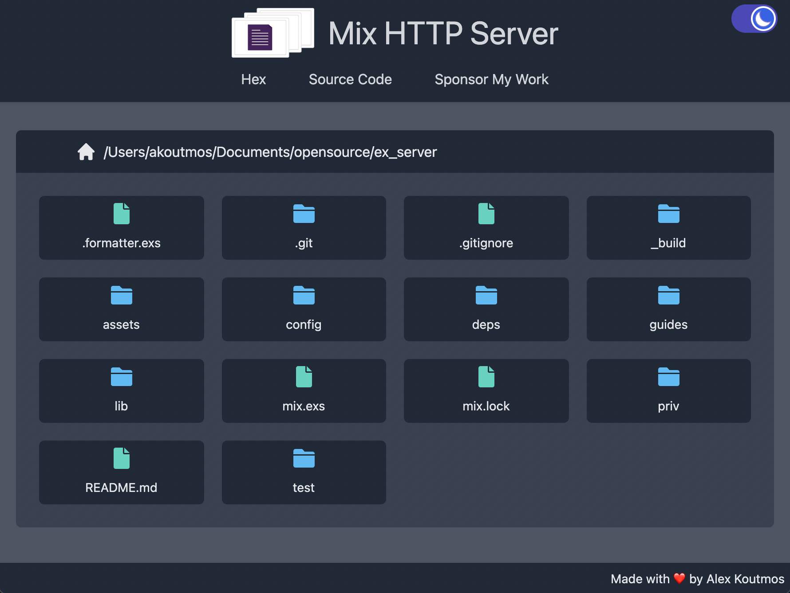

# Mix HTTP Server

## Description

Server is a simple HTTP server meant for use during local development. It makes it easy to
start a file explorer from the current working directory and open files.

## Installation and Usage

Install the archive by running: `mix archive.install hex ex_server`
Run the server from any directory by running `mix server`

## Screenshots

## Acknowledgements

https://github.com/wojtekmach/mix_install_examples
https://undraw.co/
https://merakiui.com/components/
